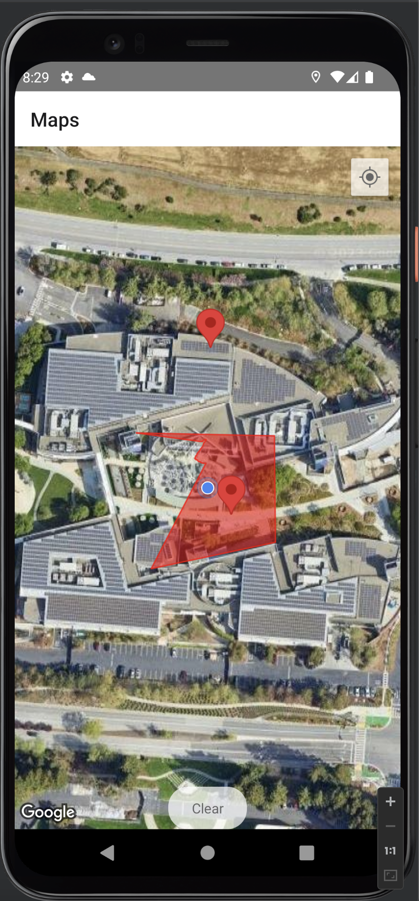
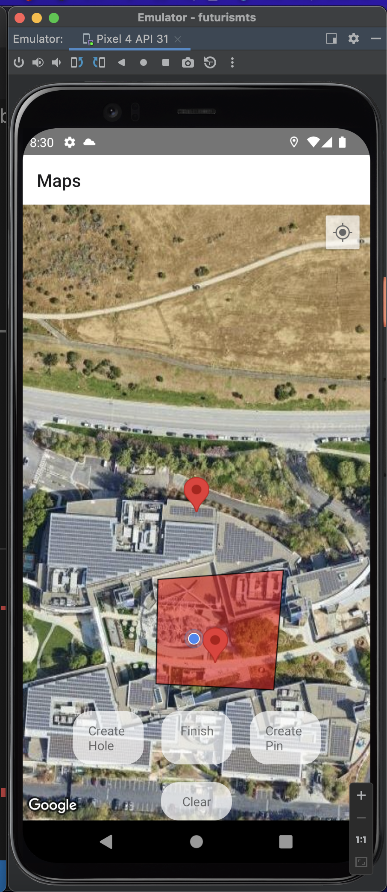
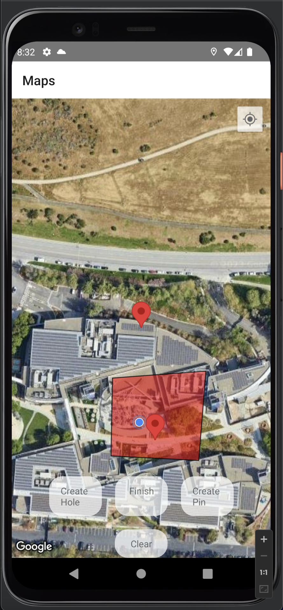
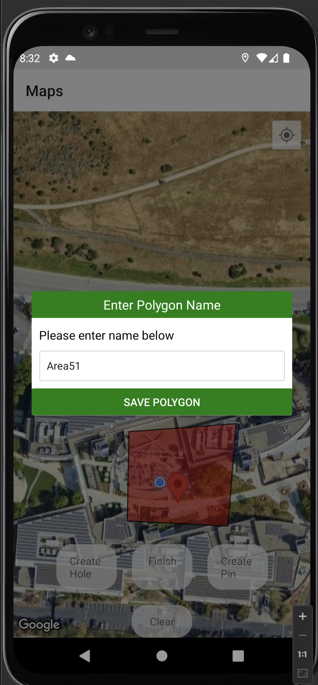
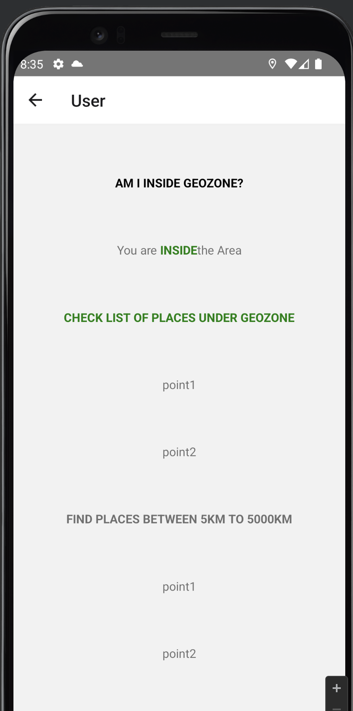

# react-native-geofenced-maps

[](https://nodei.co/npm/react-native-geofenced-maps/)

**A ReactNative's Geofenced maps component with multi-feature accessibility.**


## Very Important Note : Please Create PinPoints only during creating polygons








## Installation

Install `react-native-geofenced-maps` with [npm](https://www.npmjs.com/):

```
npm install react-native-geofenced-maps --save

```

## Usage

```javascript

const MapsConfig = {
    aspectRatio : ASPECT_RATIO,
    initialRegion : {
        latitude: LATITUDE,
        longitude: LONGITUDE,
        latitudeDelta: LATITUDE_DELTA,
        longitudeDelta: LONGITUDE_DELTA
    },
    showsUserLocation : true,
    showsMyLocationButton : true,
    provider : PROVIDER_GOOGLE,
    mapType : MAP_TYPES.SATELLITE,
    userLocationUpdateInterval : 10000,
    
}


 <MapView
          onMapReady={() => this.requestLocationPermission()}
          showsUserLocation={MapsConfig.showsUserLocation}
          showsMyLocationButton={MapsConfig.showsMyLocationButton}
          onUserLocationChange={(e) => {
            console.log("onUserLocationChange",e.nativeEvent.coordinate);
            // console.log(updateLocation);
            // updateLocation({latitude : e.nativeEvent.coordinate.latitude , longitude : e.nativeEvent.coordinate.longitude })
            this.context.updateLocation({latitude : e.nativeEvent.coordinate.latitude , longitude : e.nativeEvent.coordinate.longitude })
        }}
          provider={MapsConfig.provider}
          style={styles.map}
          mapType={MapsConfig.mapType}
          initialRegion={this.state.region}
          onPress={e => this.onPress(e)}
          onRegionChangeComplete={(e) => {this.setState({region : e})}}
          userLocationUpdateInterval={MapsConfig.userLocationUpdateInterval}
          {...mapOptions}
        >
          {this.state.createPinModeActive && (
        <Marker
          coordinate={this.state.region}
          title={"Pin For GeoFence"}
          description={"Place Pin Anywhere"}
          draggable
          tappable={true}
          onDragEnd={(e) => {console.log("onDragEnd",this.setState({pinpointCoordinate : [e.nativeEvent.coordinate.longitude , e.nativeEvent.coordinate.latitude]}) );this.setState({pinModalVisibility : true})}}
        />
        )}

        {this.state.pinpointPlaces.map((places,index) => (
          <Marker
          key={index}
          coordinate={places.coordinate}
          title={places.name}
          // description={"No Desc"}
          draggable={false}
          tappable={false}
        />
        ))}
          
          {this.state.polygons.map(polygon => {
            return (
              <Polygon
                key={polygon.id}
                coordinates={polygon.coordinates}
                holes={polygon.holes}
                strokeColor="#F00"
                fillColor="rgba(255,0,0,0.5)"
                strokeWidth={1}
                tappable
                onPress={(e) => { 
                  // this.deletePolygon(polygon.id)
                  this.showToastWithGravity(polygon.name)
                 }}
              />
            )
          })}
          {this.state.editing && (
            <Polygon
              key={this.state.editing.id}
              coordinates={this.state.editing.coordinates}
              holes={this.state.editing.holes}
              strokeColor="#000"
              fillColor="rgba(255,0,0,0.5)"
              strokeWidth={1}
            />
          )}
        </MapView>


```


## Congifuration Object


| Name      | Type     | Description                                                                     |
| --------- | -------- | ------------------------------------------------------------------------------- |
| `MapsConfig`                 | `Object`   | **Required keys.**  aspectRatio, initialRegion, showsUserLocation,showsMyLocationButton,provider,mapType,userLocationUpdateInterval|