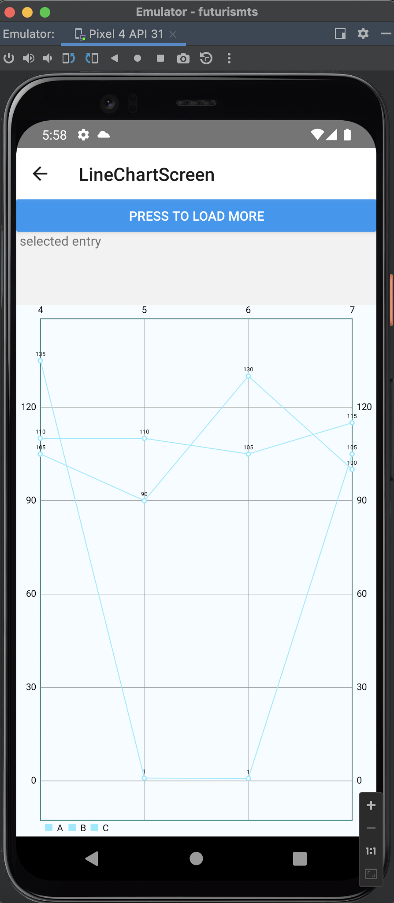
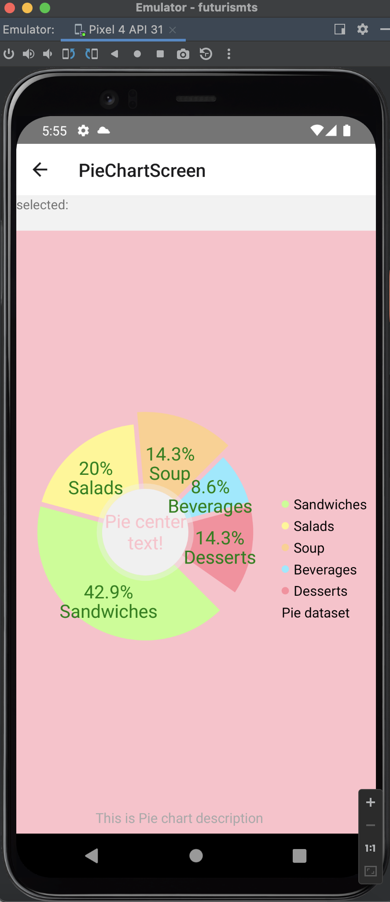
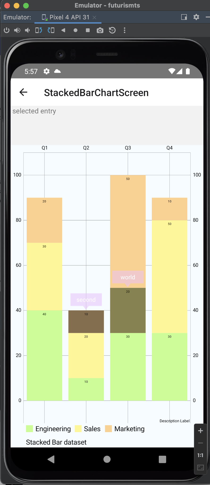
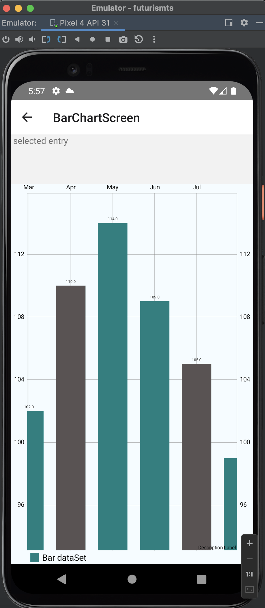

# react-native-reusable-charts

[](https://nodei.co/npm/react-native-multi-feature-flatlist/)

**A ReactNative's Chart component with multi-feature accessibility.**


## Very Important Note :







## Installation

Install `react-native-reusable-charts` with [npm](https://www.npmjs.com/):

```
npm install react-native-reusable-charts --save

```

## Usage

```javascript

export const ChartAxisConfig = (processColor, _randomYValues, COLOR_PURPLE, valueRange, size) => {
    return {
        xAxis: {
            $set: {
                textColor: processColor('red'),
                textSize: 16,
                gridColor: processColor('red'),
                gridLineWidth: 1,
                axisLineColor: processColor('darkgray'),
                axisLineWidth: 1.5,
                gridDashedLine: {
                    lineLength: 10,
                    spaceLength: 10
                },
                avoidFirstLastClipping: true,
                position: 'BOTTOM'
            }
        },
        yAxis: {
            $set: {
                left: {
                    drawGridLines: false
                },
                right: {
                    enabled: false
                }
            }
        },
        data: {
            $set: {
                dataSets: [{
                    values: _randomYValues(valueRange, size),
                    label: '',
                    config: {
                        lineWidth: 1.5,
                        drawCircles: false,
                        drawCubicIntensity: 0.3,
                        drawCubic: true,
                        drawHighlightIndicators: false,
                        color: COLOR_PURPLE,
                        drawFilled: true,
                        fillColor: COLOR_PURPLE,
                        fillAlpha: 90
                    }
                }],
            }
        }
    }
}

export const ChartBarConfig = (processColor) => {
    return {
        legend: {
            enabled: true,
            textSize: 14,
            form: 'SQUARE',
            formSize: 14,
            xEntrySpace: 10,
            yEntrySpace: 5,
            formToTextSpace: 5,
            wordWrapEnabled: true,
            maxSizePercent: 0.5
        },
        data: {
            dataSets: [{
                values: [{ y: 100 }, { y: 105 }, { y: 102 }, { y: 110 }, { y: 114 }, { y: 109 }, { y: 105 }, { y: 99 }, { y: 95 }],
                label: 'Bar dataSet',
                config: {
                    color: processColor('teal'),
                    barShadowColor: processColor('lightgrey'),
                    highlightAlpha: 90,
                    highlightColor: processColor('red'),
                }
            }],

            config: {
                barWidth: 0.7,
            }
        },
        highlights: [{ x: 3 }, { x: 6 }],
        xAxis: {
            valueFormatter: ['Jan', 'Feb', 'Mar', 'Apr', 'May', 'Jun', 'Jul', 'Aug', 'Sep'],
            granularityEnabled: true,
            granularity: 1,
        },
        animation:{durationX: 2000},
        gridBackgroundColor: processColor('#ffffff'),
        visibleRange: {x: { min: 5, max: 5 }},
        drawBarShadow:false,
        drawValueAboveBar:true,
        drawHighlightArrow:true
    }
}

export const ChartBubbleConfig = (processColor, _randomYValues, size) => {
    return {
        legend: {
            enabled: true,
            textSize: 14,
            form: 'CIRCLE',
            wordWrapEnabled: true
        },
        animation: {
            durationX: 1500,
            durationY: 1500,
            easingX: 'EaseInCirc'
        },
        data: {
            $set: {
                dataSets: [{
                    values: _randomYValues(20, size),
                    label: 'DS 1',
                    config: {
                        color: processColor('#C0FF8C'),
                        highlightCircleWidth: 2
                    }
                }, {
                    values: _randomYValues(20, size),
                    label: 'DS 2',
                    config: {
                        color: processColor('#FFF78C')
                    }
                }, {
                    values: _randomYValues(20, size),
                    label: 'DS 3',
                    config: {
                        color: processColor('#FFD08C')
                    }
                }],
            }
        }
    }
}

export const ChartCandleStickConfig = (processColor) => {
    return {
        legend: {
            enabled: true,
            textSize: 14,
            form: 'CIRCLE',
            wordWrapEnabled: true
        },
        data: {
            dataSets: [{
                values: [
                    { shadowH: 101.76, shadowL: 100.4, open: 100.78, close: 101.03 },
                    { shadowH: 101.58, shadowL: 100.27, open: 101.31, close: 101.12 },
                    { shadowH: 102.24, shadowL: 100.15, open: 101.41, close: 101.17 },
                    { shadowH: 102.28, shadowL: 101.5, open: 102.24, close: 102.23 },
                    { shadowH: 102.91, shadowL: 101.78, open: 101.91, close: 102.52 },
                    { shadowH: 105.18, shadowL: 103.85, open: 103.96, close: 104.58 },
                    { shadowH: 106.31, shadowL: 104.59, open: 104.61, close: 105.97 },
                    { shadowH: 106.47, shadowL: 104.96, open: 105.52, close: 105.8 },
                    { shadowH: 106.5, shadowL: 105.19, open: 106.34, close: 105.92 },
                    { shadowH: 107.65, shadowL: 105.1401, open: 105.93, close: 105.91 },
                    { shadowH: 107.29, shadowL: 105.21, open: 105.25, close: 106.72 },
                    { shadowH: 107.07, shadowL: 105.9, open: 106.48, close: 106.13 },
                    { shadowH: 106.25, shadowL: 104.89, open: 105.47, close: 105.67 },
                    { shadowH: 106.19, shadowL: 105.06, open: 106, close: 105.19 },
                    { shadowH: 107.79, shadowL: 104.88, open: 104.89, close: 107.7 },
                    { shadowH: 110.42, shadowL: 108.6, open: 108.65, close: 109.56 },
                    { shadowH: 109.9, shadowL: 108.88, open: 109.72, close: 108.99 },
                    { shadowH: 110, shadowL: 108.2, open: 108.78, close: 109.99 },
                    { shadowH: 112.19, shadowL: 110.27, open: 110.42, close: 111.08 },
                    { shadowH: 110.73, shadowL: 109.42, open: 109.51, close: 109.81 },
                    { shadowH: 110.98, shadowL: 109.2, open: 110.23, close: 110.96 },
                    { shadowH: 110.42, shadowL: 108.121, open: 109.95, close: 108.54 },
                    { shadowH: 109.77, shadowL: 108.17, open: 108.91, close: 108.66 },
                    { shadowH: 110.61, shadowL: 108.83, open: 108.97, close: 109.04 },
                    { shadowH: 110.5, shadowL: 108.66, open: 109.34, close: 110.44 },
                    { shadowH: 112.34, shadowL: 110.8, open: 110.8, close: 112.0192 },
                    { shadowH: 112.39, shadowL: 111.33, open: 111.62, close: 112.1 },
                    { shadowH: 112.3, shadowL: 109.73, open: 112.11, close: 109.85 },
                    { shadowH: 108.95, shadowL: 106.94, open: 108.89, close: 107.48 },
                    { shadowH: 108, shadowL: 106.23, open: 107.88, close: 106.91 },
                    { shadowH: 108.09, shadowL: 106.06, open: 106.64, close: 107.13 },
                    { shadowH: 106.93, shadowL: 105.52, open: 106.93, close: 105.97 },
                    { shadowH: 106.48, shadowL: 104.62, open: 105.01, close: 105.68 },
                    { shadowH: 105.65, shadowL: 104.51, open: 105, close: 105.08 },
                    { shadowH: 105.3, shadowL: 103.91, open: 103.91, close: 104.35 },
                    { shadowH: 98.71, shadowL: 95.68, open: 96, close: 97.82 },
                    { shadowH: 97.88, shadowL: 94.25, open: 97.61, close: 94.8075 },
                    { shadowH: 94.72, shadowL: 92.51, open: 93.99, close: 93.75 },
                    { shadowH: 94.08, shadowL: 92.4, open: 93.965, close: 93.65 },
                    { shadowH: 95.74, shadowL: 93.68, open: 94.2, close: 95.18 },
                    { shadowH: 95.9, shadowL: 93.82, open: 95.2, close: 94.19 },
                    { shadowH: 94.07, shadowL: 92.68, open: 94, close: 93.24 },
                    { shadowH: 93.45, shadowL: 91.85, open: 93.37, close: 92.72 },
                    { shadowH: 93.77, shadowL: 92.59, open: 93, close: 92.82 },
                    { shadowH: 93.57, shadowL: 92.11, open: 93.33, close: 93.39 },
                    { shadowH: 93.57, shadowL: 92.46, open: 93.48, close: 92.51 },
                    { shadowH: 92.78, shadowL: 89.47, open: 92.72, close: 90.32 },
                    { shadowH: 91.67, shadowL: 90, open: 90, close: 90.52 }
                ],
                label: 'AAPL',
                config: {
                    highlightColor: processColor('darkgray'),

                    shadowColor: processColor('black'),
                    shadowWidth: 1,
                    shadowColorSameAsCandle: true,
                    increasingColor: processColor('#71BD6A'),
                    increasingPaintStyle: 'FILL',
                    decreasingColor: processColor('#D14B5A')
                },
                xAxis: {},
                yAxis: {},
            }],
        },
        marker: {
            enabled: true,
            markerColor: processColor('#2c3e50'),
            textColor: processColor('white'),
        },
        zoomXValue: 0
    }
}

export const ChartCombinedConfig = (processColor) => {
    return {
        xAxis: {
            valueFormatter: ['1990', '1991', '1992', '1993', '1994'],
            granularityEnabled: true,
            granularity: 1
        },

        yAxis: {
            left: {
                granularityEnabled: true,
                granularity: 10
            },
            right: {
                granularityEnabled: true,
                granularity: 100
            }
        },

        marker: {
            enabled: true,
            markerColor: processColor('#F0C0FF8C'),
            textColor: processColor('white'),
            markerFontSize: 14,
        },

        data: {
            barData: {
                dataSets: [{
                    values: [{ y: [40, 30, 20], marker: ["row1", "row2", "row3"] }, { y: [10, 20, 10], marker: "second" }, { y: [30, 20, 50], marker: ["hello", "world", "third"] }, { y: [30, 50, 10], marker: "fourth" }],
                    label: 'Stacked Bar dataset',
                    config: {
                        colors: [processColor('#C0FF8C'), processColor('#FFF78C'), processColor('#FFD08C')],
                        stackLabels: ['Engineering', 'Sales', 'Marketing']
                    }
                }],
            },
            lineData: {
                dataSets: [{
                    values: [50, 100, 50, 100, 50],
                    label: 'Sine function',

                    config: {
                        drawValues: false,
                        colors: [processColor('green')],
                        mode: "CUBIC_BEZIER",
                        drawCircles: false,
                        lineWidth: 2,
                        axisDependency: "RIGHT",
                    }
                }, {
                    values: [100, 50, 100, 50, 100],
                    label: 'Cosine function',

                    config: {
                        drawValues: false,
                        colors: [processColor('blue')],
                        mode: "CUBIC_BEZIER",
                        drawCircles: false,
                        lineWidth: 2,
                    }
                }],
            },
            bubbleData: {
                dataSets: [{
                    values: [{
                        size: 2.3,
                        y: 180,
                        marker: "marker 1"
                    }, {
                        size: 1.4,
                        y: 150,
                        marker: "marker 2"
                    }, {
                        size: 2.0,
                        y: 106,
                        marker: "marker 3"
                    }, {
                        size: 5.0,
                        y: 100
                    }, {
                        size: 4.1,
                        y: 65
                    }],
                    label: 'Company A',
                    config: {
                        drawValues: false,
                        colors: [processColor('pink')],
                        axisDependency: "RIGHT",
                    }
                }],
            },
            candleData: {
                dataSets: [{
                    values: [{
                        shadowH: 20,
                        shadowL: 5,
                        open: 15,
                        close: 10,
                        marker: "marker 1"
                    }, {
                        shadowH: 30,
                        shadowL: 10,
                        open: 25,
                        close: 15,
                        marker: "marker 1"
                    }, {
                        shadowH: 10,
                        shadowL: 5,
                        open: 15,
                        close: 10,
                        marker: "marker 1"
                    }, {
                        shadowH: 50,
                        shadowL: 5,
                        open: 15,
                        close: 25
                    }],
                    label: 'Company A',

                    config: {
                        drawValues: false,
                        axisDependency: "RIGHT",
                        highlightColor: processColor('darkgray'),

                        shadowColor: processColor('black'),
                        shadowWidth: 1,
                        shadowColorSameAsCandle: true,
                        increasingColor: processColor('yellow'),
                        increasingPaintStyle: 'FILL',
                        decreasingColor: processColor('green')
                    }
                }],
            },
            scatterData: {
                dataSets: [{
                    values: [15, 40, 77, 81, 43],
                    label: 'Company A',

                    config: {
                        colors: [processColor('purple')],
                        drawValues: false,
                        scatterShape: 'SQUARE',
                    }

                }, {
                    values: [40, 5, 50, 23, 79],
                    label: 'Company B',

                    config: {
                        drawValues: false,
                        colors: [processColor('grey')],
                        scatterShape: 'CIRCLE',
                    }
                }, {
                    values: [10, 55, 35, 90, 82],
                    label: 'Company C',

                    config: {
                        drawValues: false,
                        axisDependency: "RIGHT",
                        colors: [processColor('brown')],
                        scatterShape: 'TRIANGLE',
                    }
                }],
            },
        }
    }
}

export const ChartGroupBarConfig = (processColor) => {
    return {
        legend: {
            enabled: true,
            textSize: 14,
            form: "SQUARE",
            formSize: 14,
            xEntrySpace: 10,
            yEntrySpace: 5,
            wordWrapEnabled: true
        },
        data: {
            dataSets: [{
                values: [5, 40, 77, 81, 43],
                label: 'Company A',
                config: {
                    drawValues: false,
                    colors: [processColor('red')],
                }
            }, {
                values: [40, 5, 50, 23, 79],
                label: 'Company B',
                config: {
                    drawValues: false,
                    colors: [processColor('blue')],
                }
            }, {
                values: [10, 55, 35, 90, 82],
                label: 'Company C',
                config: {
                    drawValues: false,
                    colors: [processColor('green')],
                }
            }],
            config: {
                barWidth: 0.2,
                group: {
                    fromX: 0,
                    groupSpace: 0.1,
                    barSpace: 0.1,
                },
            }
        },
        xAxis: {
            valueFormatter: ['1990', '1991', '1992', '1993', '1994'],
            granularityEnabled: true,
            granularity: 1,
            axisMaximum: 5,
            axisMinimum: 0,
            centerAxisLabels: true
        },

        marker: {
            enabled: true,
            markerColor: processColor('#F0C0FF8C'),
            textColor: processColor('white'),
            markerFontSize: 14,
        },

    };
}

export const HorizontalBarConfig = (processColor) => {
    return {
        legend: {
            enabled: true,
            textSize: 14,
            form: 'SQUARE',
            formSize: 14,
            xEntrySpace: 10,
            yEntrySpace: 5,
            formToTextSpace: 5,
            wordWrapEnabled: true,
            maxSizePercent: 0.5,
        },
        data: {
            dataSets: [{
                values: [{ y: 100 }, { y: 105 }, { y: 102 }, { y: 110 }, { y: 114 }, { y: 109 }, { y: 105 }, { y: 99 }, { y: 95 }],
                label: 'Bar dataSet',
                config: {
                    color: processColor('teal'),
                    barShadowColor: processColor('lightgrey'),
                    highlightAlpha: 90,
                    highlightColor: processColor('red'),
                }
            }],
        },
        xAxis: {
            valueFormatter: ['Jan', 'Feb', 'Mar', 'Apr', 'May', 'Jun', 'Jul', 'Aug', 'Sep'],
            position: 'BOTTOM',
            granularityEnabled: true,
            granularity: 1,
            labelCount: 10,
        },
        yAxis: { left: { axisMinimum: 0 } }
    }
}

export const LineChartGradientConfig = (processColor, petrel, greenBlue) => {
    return {
        data: {
            dataSets: [
                {
                    values: [
                        {
                            y: 65,
                            x: 0,
                            marker: "65 kg"
                        },
                        {
                            y: 77,
                            x: 1,
                            marker: "77 kg"
                        },
                        {
                            y: 76,
                            x: 2,
                            marker: "76 kg"
                        },
                        {
                            y: 74,
                            x: 3,
                            marker: "74 kg"
                        },
                        {
                            y: 76,
                            x: 4,
                            marker: "76 kg"
                        },
                        {
                            y: 65,
                            x: 5,
                            marker: "Today: 65 kg"
                        }
                    ],
                    label: "",
                    config: {
                        mode: "CUBIC_BEZIER",
                        drawValues: false,
                        lineWidth: 2,
                        drawCircles: true,
                        circleColor: processColor(petrel),
                        drawCircleHole: false,
                        circleRadius: 5,
                        highlightColor: processColor("transparent"),
                        color: processColor(petrel),
                        drawFilled: true,
                        fillGradient: {
                            colors: [processColor(petrel), processColor(greenBlue)],
                            positions: [0, 0.5],
                            angle: 90,
                            orientation: "TOP_BOTTOM"
                        },
                        fillAlpha: 1000,
                        valueTextSize: 15
                    }
                },

                {
                    values: [
                        {
                            y: 35,
                            x: 0,
                            marker: "35 kg"
                        },
                        {
                            y: 47,
                            x: 1,
                            marker: "47 kg"
                        },
                        {
                            y: 46,
                            x: 2,
                            marker: "46 kg"
                        },
                        {
                            y: 44,
                            x: 3,
                            marker: "44 kg"
                        },
                        {
                            y: 46,
                            x: 4,
                            marker: "46 kg"
                        },
                        {
                            y: 35,
                            x: 5,
                            marker: "Today: 35 kg"
                        }
                    ],
                    label: "",
                    config: {
                        mode: "CUBIC_BEZIER",
                        drawValues: false,
                        lineWidth: 2,
                        drawCircles: true,
                        circleColor: processColor(petrel),
                        drawCircleHole: false,
                        circleRadius: 5,
                        highlightColor: processColor("transparent"),
                        color: processColor(petrel),
                        drawFilled: true,
                        fillGradient: {
                            colors: [processColor('red'), processColor('yellow')],
                            positions: [0, 0.5],
                            angle: 90,
                            orientation: "TOP_BOTTOM"
                        },
                        fillAlpha: 1000,
                        valueTextSize: 15
                    }
                }
            ]
        },

        marker: {
            enabled: true,
            markerColor: processColor("white"),
            textColor: processColor("black")
        },
        xAxis: {
            enabled: true,
            granularity: 1,
            drawLabels: true,
            position: "BOTTOM",
            drawAxisLine: true,
            drawGridLines: false,
            // fontFamily: "HelveticaNeue-Medium",
            fontWeight: "bold",
            textSize: 12,
            textColor: processColor("gray"),
            valueFormatter: ["M", "T", "W", "T", "F", "S"]
        },
        yAxis: {
            left: {
                enabled: false
            },
            right: {
                enabled: false
            }
        },
        animation: {
            durationX: 0,
            durationY: 1500,
            easingY: "EaseInOutQuart"
        },
        legend: {
            enabled: false
        },
        autoScaleMinMaxEnabled: true,
        drawGridBackground: false,
        drawBorders: false,
        touchEnabled: true,
        dragEnabled: false,
        scaleEnabled: false,
        scaleXEnabled: false,
        scaleYEnabled: false,
        pinchZoom: false,
        doubleTapToZoomEnabled: false,
        dragDecelerationEnabled: true,
        dragDecelerationFrictionCoef: 0.99,
        keepPositionOnRotation: false
    }
}

export const LineChartConfig = (processColor) => {
    return {
        marker: {
            enabled: true,
            digits: 2,
            backgroundTint: processColor('teal'),
            markerColor: processColor('#F0C0FF8C'),
            textColor: processColor('white'),
        },
        xAxis: {
            granularityEnabled: true,
            granularity: 1,
        },
        data: {
            $set: {
                dataSets: [{
                    values: [{ x: 4, y: 135 }, { x: 5, y: 0.88 }, { x: 6, y: 0.77 }, { x: 7, y: 105 }], label: 'A',
                }, {
                    values: [{ x: 4, y: 105 }, { x: 5, y: 90 }, { x: 6, y: 130 }, { x: 7, y: 100 }], label: 'B',
                }, {
                    values: [{ x: 4, y: 110 }, { x: 5, y: 110 }, { x: 6, y: 105 }, { x: 7, y: 115 }], label: 'C',
                }],
            }
        },
        drawGridBackground: false,
        borderColor: processColor('teal'),
        borderWidth: 1,
        drawBorders: true,
        autoScaleMinMaxEnabled: false,
        touchEnabled: true,
        dragEnabled: true,
        scaleEnabled: true,
        scaleXEnabled: true,
        scaleYEnabled: true,
        pinchZoom: true,
        doubleTapToZoomEnabled: true,
        highlightPerTapEnabled: true,
        highlightPerDragEnabled: false,
        // visibleRange={this.state.visibleRange}
        dragDecelerationEnabled: true,
        dragDecelerationFrictionCoef: 0.99,
        keepPositionOnRotation: false,
    }
}

export const LinkageChartConfig = () => {
    return {
        priceData: {
            dataSets: [{
                values: Array.from(new Array(600), (val, index) => index),
                label: 'price',
            }]
        },
        volumeData: {
            dataSets: [{
                values: Array.from(new Array(600), (val, index) => index),
                label: 'volume',
            }]
        },
        group: "stock",
        identifierChart1: "price",
        identifierChart2: "volume",
        syncX: true,
        syncY: true,
        visibleRange: { x: { min: 1, max: 100 } },
        dragDecelerationEnabled: false,
        doubleTapToZoomEnabled: false,
    }
}

export const PieChartConfig = (processColor) => {
     return {
        legend: {
            enabled: true,
            textSize: 15,
            form: 'CIRCLE',
            horizontalAlignment: "RIGHT",
            verticalAlignment: "CENTER",
            orientation: "VERTICAL",
            wordWrapEnabled: true
          },
          data: {
            dataSets: [{
              values: [{value: 45, label: 'Sandwiches'},
                {value: 21, label: 'Salads'},
                {value: 15, label: 'Soup'},
                {value: 9, label: 'Beverages'},
                {value: 15, label: 'Desserts'}],
              label: 'Pie dataset',
              config: {
                colors: [processColor('#C0FF8C'), processColor('#FFF78C'), processColor('#FFD08C'), processColor('#8CEAFF'), processColor('#FF8C9D')],
                valueTextSize: 20,
                valueTextColor: processColor('green'),
                sliceSpace: 5,
                selectionShift: 13,
                // xValuePosition: "OUTSIDE_SLICE",
                // yValuePosition: "OUTSIDE_SLICE",
                valueFormatter: "#.#'%'",
                valueLineColor: processColor('green'),
                valueLinePart1Length: 0.5
              }
            }],
          },
          highlights: [{x:2}],
          description: {
            text: 'This is Pie chart description',
            textSize: 15,
            textColor: processColor('darkgray'),
          },
          logEnabled:true,
          chartBackgroundColor: processColor('pink'),
          extraOffsets:{left: 5, top: 5, right: 5, bottom: 5},
          entryLabelColor:processColor('green'),
          entryLabelTextSize:20,
        //   entryLabelFontFamily:'HelveticaNeue-Medium',
          drawEntryLabels:true,
          rotationEnabled:true,
          rotationAngle:45,
          usePercentValues:true,
          styledCenterText:{text:'Pie center text!', color: processColor('pink'), 
        //   fontFamily: 'HelveticaNeue-Medium', 
          size: 20},
          centerTextRadiusPercent:100,
          holeRadius:40,
          holeColor: processColor('#f0f0f0'),
          transparentCircleRadius:45,
          transparentCircleColor:processColor('#f0f0f088'),
          maxAngle:350
        };
     
    }

export const ScatterChartConfig = (processColor,_randomYValues,size,range) => {
    return {
        legend: {
            enabled: true,
            textSize: 14,
            form: 'CIRCLE',
            wordWrapEnabled: true
          },
          marker: {
            enabled: true,
            type: 'com.github.reactNativeMPAndroidChart.example.marker.OvalBlueMarker'
          },
        data: {
            $set: {
              dataSets: [{
                values: _randomYValues(range, size),
                label: 'DS 1',
                config: {
                  color: processColor('gray'),
                  scatterShape: 'X'
                }
              }, {
                values: _randomYValues(range, size),
                label: 'DS 2',
                config: {
                  color: processColor('blue'),
                  scatterShape: 'CIRCLE',
                  scatterShapeHoleRadius: 6,
                  scatterShapeHoleColor: processColor('teal')
                }
              }, {
                values: _randomYValues(range, size),
                label: 'DS 3',
                config: {
                  color: processColor('green'),
                  drawHighlightIndicators: false,
                  scatterShape: 'SQUARE',
                  scatterShapeSize: 8
                }
              }],
            }
          }
    }
}


```


## Functions

| Name                     | Type       | Description                                                                                                                                                            |
| ------------------------ | ---------- | ---------------------------------------------------------------------------------------------------------------------------------------------------------------------- |
                                                                                                                               |
| `ChartAxisConfig`                 | `Object`   | **Required keys.**  xAxis, yAxis, data|
| `ChartBarConfig`                 | `Object`   | **Required keys.**  legend, data,xAxis,highlights,animation,gridBackgroundColor,visibleRange,drawBarShadow,drawValueAboveBar,drawHighlightArrow|
| `ChartBubbleConfig`                 | `Object`   | **Required Keys.**  legend, animation, data|
| `ChartCandleStickConfig`                 | `Object`   | **Required Keys.**  legend, data, marker, zoomXValue|
| `ChartGroupBarConfig`                 | `Object`   | **Required Keys.**  xAxis,legend, data, marker|
| `HorizontalBarConfig`                 | `Object`   | **Required Keys.**  legend, data, xAxis, yAxis|
| `LineChartGradientConfig`                 | `Object`   | **Required Keys.**  legend, data, marker,xAxis,autoScaleMinMaxEnabled,drawGridBackground,drawBorders,touchEnabled,dragEnabled,scaleEnabled,scaleXEnabled,scaleYEnabled,pinchZoom,doubleTapToZoomEnabled,dragDecelerationEnabled,dragDecelerationFrictionCoef,keepPositionOnRotation|
| `LineChartConfig`                 | `Object`   | **Required Keys.**  legend, data, marker,xAxis, yAxis,animation,autoScaleMinMaxEnabled,drawGridBackground,drawBorders,touchEnabled,dragEnabled,scaleEnabled,scaleXEnabled,scaleYEnabled,pinchZoom,doubleTapToZoomEnabled,dragDecelerationEnabled,dragDecelerationFrictionCoef,keepPositionOnRotation|
| `LinkageChartConfig`                 | `Object`   | **Required Keys.**  priceData, group, identifierChart1, identifierChart2,syncX,syncY,visibleRange,dragDecelerationEnabled,doubleTapToZoomEnabled|
| `PieChartConfig`                 | `Object`   | **Required Keys.**  legend, data, highlights, description,logEnabled,chartBackgroundColor,extraOffsets,entryLabelColor,entryLabelTextSize,drawEntryLabels,rotationEnabled,rotationAngle,usePercentValues,styledCenterText,size,centerTextRadiusPercent,holeRadius,holeColor,transparentCircleRadius,transparentCircleColor,maxAngle|
| `PieChartConfig`                 | `Object`   | **Required Keys.**  legend, data, highlights, description,logEnabled,chartBackgroundColor,extraOffsets,entryLabelColor,entryLabelTextSize,drawEntryLabels,rotationEnabled,rotationAngle,usePercentValues,styledCenterText,size,centerTextRadiusPercent,holeRadius,holeColor,transparentCircleRadius,transparentCircleColor,maxAngle|
| `ScatterChartConfig`                 | `Object`   | **Required Keys.**  legend, data, marker|
| `StockChartConfig`                 | `Object`   | **Required Keys.**  priceXaxis, volumeXaxis, visibleRange,CombinedData,volumeData|