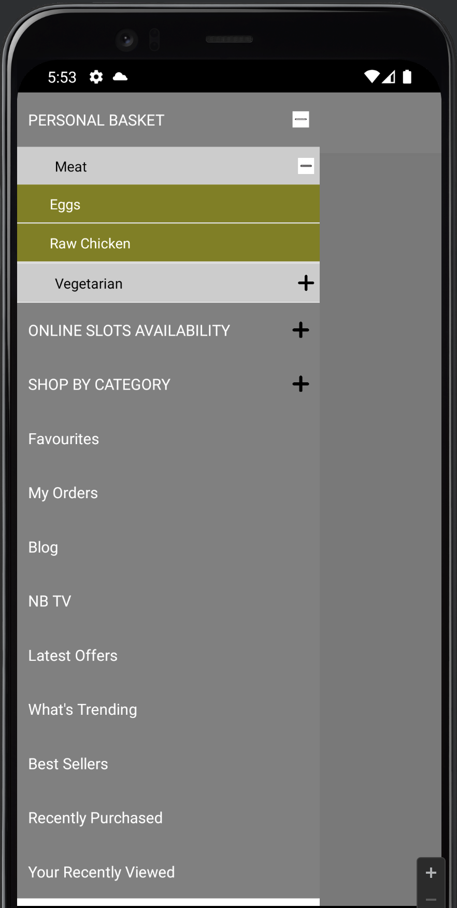

# react-native-reusable-drawer

[](https://nodei.co/npm/react-native-feature-drawer/)

**A ReactNative's Drawer component with features accessibility.**


## Very Important Note :




## Installation

Install `react-native-reusable-drawer` with [npm](https://www.npmjs.com/):

```
npm install react-native-reusable-drawer --save

```

## Usage

```javascript
const configuration = {
    drawerData : SuperCategoryData,
    plusImgUrl : 'https://cdn-icons-png.flaticon.com/512/3524/3524388.png',
    minusImgUrl : 'https://thumbs.dreamstime.com/z/minus-sign-icon-vector-symbol-isolated-white-background-logo-concept-your-web-mobile-app-design-133735659.jpg',
    subCatKeyName : 'subCategoryData',
    childCatKeyName : 'childCategoryData',
    StackScreen : StackScreen
  }

  return (
       <ReusableDrawer
       config={configuration}
       /> 
  );
```


## Object


| KeyName      | Type     | Description                                                                     |
| --------- | -------- | ------------------------------------------------------------------------------- |
| `drawerData`                 | `Array`   | This should be the data required for drawer |
| `StackScreen`                 | `Object`   | This should be the list of screens required for App|
| `plusImgUrl`                 | `String`   | Provide any Image url from web|
| `minusImgUrl`                 | `String`   | Provide any Image url from web|
| `subCatKeyName`                 | `String`   | Provide keyname for subCategory inside parentCategory |
| `childCatKeyName`                 | `String`   | Provide keyname for childCategory inside subCategory |