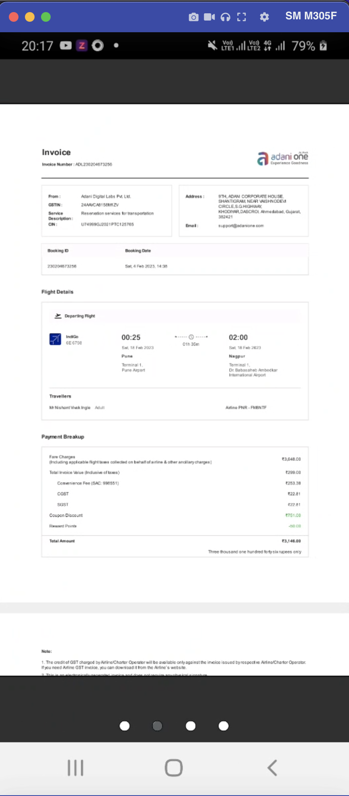
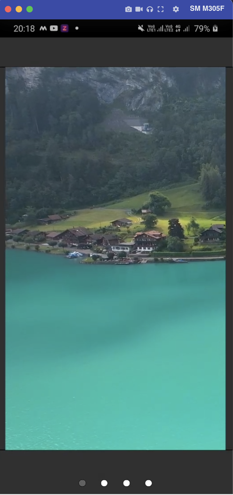

# react-native-document-media-slider

[](https://nodei.co/npm/react-native-document-media-slider/)

**A ReactNative's Reanimated Slider component with multi-feature accessibility.**

By installing this slider component, you will be able to render multiple documents that including video file,pdf,images like png,jpeg,jpg.You can Swipe it left and right.If list reaches the end then it will loop.Video will autoplay.





## Installation

Install `react-native-document-media-slider` with [npm](https://www.npmjs.com/):

```
npm install react-native-document-media-slider --save

```

## Usage

```javascript


import React, { useEffect, useRef, useState } from 'react';
import {
  SafeAreaView,
  ScrollView,
  StatusBar,
  StyleSheet,
  Text,
  useColorScheme,
  View,
  Dimensions,
  Image,
  Button
} from 'react-native';

import {
  Colors
} from 'react-native/Libraries/NewAppScreen';
import RNBootSplash from "react-native-bootsplash";
import Carousel from 'react-native-reanimated-carousel';
import { TAnimationStyle } from './src/layouts/BaseLayout';
import Animated, { Extrapolate, interpolate, interpolateColor, useAnimatedStyle, useSharedValue } from 'react-native-reanimated';
import { SBItem } from './src/exampleExpo/src/components/SBItem';
import App2 from './App2';
import AppParellax from './AppParellax';
import Video from 'react-native-video';
import Pdf from 'react-native-pdf';
import { ImageZoom } from '@likashefqet/react-native-image-zoom';
import { GestureHandlerRootView } from 'react-native-gesture-handler';


function App(): JSX.Element {
  const isDarkMode = useColorScheme() === 'dark';
  const width = Dimensions.get('window').width;
  const progressValue = useSharedValue<number>(0);
  const [images, setImages] = useState([]);

  interface ItemProps {
    index: number
    animationValue: Animated.SharedValue<number>
  }


  const backgroundStyle = {
    backgroundColor: isDarkMode ? Colors.darker : Colors.lighter,
  };

  const CustomItem: React.FC<ItemProps> = ({ index, animationValue }) => {
    const maskStyle = useAnimatedStyle(() => {
      const backgroundColor = interpolateColor(
        animationValue.value,
        [-1, 0, 1],
        ["transparent", "transparent", "transparent"],
      );

      return {
        backgroundColor,
      };
    }, [animationValue]);

    return (
      <View style={{ flex: 1 }}>
        <SBItem key={index} index={index} style={{ borderRadius: 0 }} />
        <Animated.View
          pointerEvents="none"
          style={[
            {
              position: "absolute",
              top: 0,
              left: 0,
              right: 0,
              bottom: 0,
            },
            maskStyle,
          ]}
        />
      </View>
    );
  };

  const animationStyle: TAnimationStyle = React.useCallback(
    (value: number) => {
      "worklet";

      const zIndex = interpolate(value, [-1, 0, 1], [10, 20, 30]);
      const translateX = interpolate(
        value,
        [-2, 0, 1],
        [-60, 0, 40],
      );

      return {
        transform: [{ translateX }],
        zIndex,
      };
    },
    [],
  );

  const PaginationItem: React.FC<{
    index: number
    backgroundColor: string
    length: number
    animValue: Animated.SharedValue<number>
    isRotate?: boolean
  }> = (props) => {
    const { animValue, index, length, backgroundColor, isRotate } = props;
    const width = 10;
  
    const animStyle = useAnimatedStyle(() => {
      let inputRange = [index - 1, index, index + 1];
      let outputRange = [-width, 0, width];
  
      if (index === 0 && animValue?.value > length - 1) {
        inputRange = [length - 1, length, length + 1];
        outputRange = [-width, 0, width];
      }
  
      return {
        transform: [
          {
            translateX: interpolate(
              animValue?.value,
              inputRange,
              outputRange,
              Extrapolate.CLAMP,
            ),
          },
        ],
      };
    }, [animValue, index, length]);

    return (
        <View
          onTouchEnd={() => {

          }}
          style={{
            backgroundColor: "white",
            width,
            height: width,
            borderRadius: 50,
            overflow: "hidden",
            transform: [
              {
                rotateZ: isRotate ? "90deg" : "0deg",
              },
            ],
            borderColor : 'black',
            borderWidth : 0.5
          }}
        >
          <Animated.View
            style={[
              {
                borderRadius: 50,
                backgroundColor,
                flex: 1,
              },
              animStyle,
            ]}
          />
        </View>
      );
        }

  useEffect(() => {
    RNBootSplash.hide({ fade: true, duration: 5000 });
    console.log("Bootsplash has been hidden successfully");
  }, []);


  useEffect(() => {
    fetch("http://192.168.43.194:4242/storage/getFiles").then(async res => {
      let response = await res.json();
      return response.files;
    }).then(final => {
      // setImages(final.filter(item => item.mimeType !== 'application/pdf'));
      // setImagesIndex(final.filter(item => item.mimeType !== 'application/pdf' && item.mimeType !== 'video/mp4' && item.mimeType !== 'video/quicktime'))
      setImages(final);
    })
  }, [])

 


  return (
    <GestureHandlerRootView style={{ flex: 1 }}>
    <View style={{ flex: 1, justifyContent: 'center', alignItems: 'center' }}>
      <Carousel
        loop
        width={width}
        height={Dimensions.get('window').height - 100 }
        autoPlay={true}
        testID='CAROUSEL_ITEM_0_READY'
        data={images}
        autoPlayInterval={8000}
        style={{flex : 1,alignItems : 'center',justifyContent : 'center'}}
        scrollAnimationDuration={1000}
        panGestureHandlerProps={{
          activeOffsetX: [-10, 10],
        }}
        onSnapToItem={(index) => {console.log('current index:', index)}}
        renderItem={({ item,index }) => {
          if(item.mimeType !== 'video/quicktime' && item.mimeType !== 'video/mp4' && item.mimeType !== 'application/pdf'){
            console.log("inside Image");
            
            return(
              <View
              style={{
                flex: 1,
                borderWidth: 1,
                justifyContent: 'center',
              }}
            >
              
            <ImageZoom
            uri={
               `http://192.168.43.194:4242/uploads/${item.name}`
            }
            minScale={0.5}
            maxScale={3}
            onInteractionStart={() => console.log('Interaction started')}
            onInteractionEnd={() => console.log('Interaction ended')}
            onPinchStart={() => console.log('Pinch gesture started')}
            onPinchEnd={() => console.log('Pinch gesture ended')}
            onPanStart={() => console.log('Pan gesture started')}
            onPanEnd={() => console.log('Pan gesture ended')}
            isPanEnabled={true}
            isPinchEnabled={true}
        //   renderLoader={() => <CustomLoader />}
        />
            </View>
            )
          }else if(item.mimeType !== 'application/pdf'){
            console.log("inside Video");
            return (
            <View
              style={{
                flex: 1,
                borderWidth: 1,
                justifyContent: 'center',
              }}
            >
            <Video source={{uri: `http://192.168.43.194:4242/uploads/${item.name}`}}   // Can be a URL or a local file.                                  // Store reference
            paused={false}
            repeat={true}
            style={{
              width: Dimensions.get('window').width - 20,
              height: Dimensions.get('window').height -100,
              marginVertical: 30,
              alignSelf: 'center',
              // aspectRatio : 90/50
            }}
            posterResizeMode={'cover'}
            // controls={true}
            />
            </View> )
          }else{ 
            console.log("inside Pdf");
            return(
              <View
              style={{
                flex: 1,
                borderWidth: 1,
                justifyContent: 'center',
              }}
            >
              <Pdf
                    source={{ uri: `http://192.168.43.194:4242/uploads/${item.name}`, cache: true }}
                    onLoadComplete={(numberOfPages,filePath) => {
                        console.log(`Number of pages: ${numberOfPages}`);
                    }}
                    trustAllCerts={false}
                    onPageChanged={(page,numberOfPages) => {
                        console.log(`Current page: ${page}`);
                    }}
                    onError={(error) => {
                        console.log(error);
                    }}
                    onPressLink={(uri) => {
                        console.log(`Link pressed: ${uri}`);
                    }}
                    style={{
                      flex:1,
                      width:Dimensions.get('window').width,
                      height:Dimensions.get('window').height,
                  }}/>
                  </View>
            )
             
          }
         
             
        }}
        onProgressChange={(_, absoluteProgress) =>
          (progressValue.value = absoluteProgress)
        }
      />

{!!progressValue && (
        <View
          style={{
                flexDirection: "row",
                justifyContent: "space-between",
                width: 100,
                alignSelf: "center",
                marginBottom : 10
        }}
        >
          {images.map((backgroundColor, index) => {
            return (
              <PaginationItem
                backgroundColor={"#5C6265"}
                animValue={progressValue}
                index={index}
                key={index}
                isRotate={false}
                length={images.length}
              />
            );
          })}
        </View>
      )}

      {/* <App2/> */}
      {/* <AppParellax/> */}
      {/* <Button
        onPress={() => {
          setLoop(!loop);
        }}
        title={loop ? 'Turn off autoplay' : 'Turn on autoplay'}
        color={"red"}
      /> */}


    </View>
    </GestureHandlerRootView>

  );
}

const styles = StyleSheet.create({
  sectionContainer: {
    marginTop: 32,
    paddingHorizontal: 24,
  },
  sectionTitle: {
    fontSize: 24,
    fontWeight: '600',
  },
  sectionDescription: {
    marginTop: 8,
    fontSize: 18,
    fontWeight: '400',
  },
  highlight: {
    fontWeight: '700',
  },
});


```

## Props

| Name                     | Type       | Description                                                                                                                                                            |
| ------------------------ | ---------- | ---------------------------------------------------------------------------------------------------------------------------------------------------------------------- |
| `data`                   | `array`    | **Required.** The array which contains data to be render into the cards.                                                                                                                               |
| `configuration`                 | `object`   | **Required.** The object contains boolean parameters to enable/disable features.Objects contains below keys : 
      enableLazyLoading 
      listView,
      gridView,
      loadMoreButton,
                                                                                                                                  |